./

# Architecture

Agent Bouncer sits **on the request path**, in front of your LLM/agent. It runs on *every*
call (and every agent step), so it must be small and fast — which is exactly why a
**small language model (SLM)** is the right tool, not a compromise. This document explains
how the whole system fits together, layer by layer, with diagrams.

---

## 1 · Where it runs

The bouncer screens input **before** it reaches the model, and (optionally) screens what the
model is about to do or return.

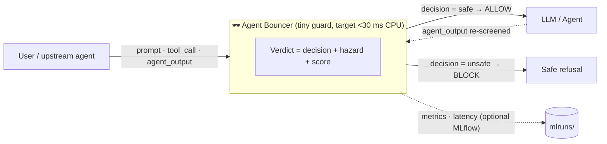

**Surfaces** (`agent_bouncer.core.schema.Surface`) — guarding *agents* means screening more than
user text:

| Surface          | What it protects against                                           |
| ---------------- | ------------------------------------------------------------------ |
| `user_prompt`  | content harm, prompt injection, jailbreaks in the incoming request |
| `tool_call`    | a dangerous action the agent is about to execute                   |
| `agent_output` | unsafe content the agent is about to return                        |

---

## 2 · The core contract: one `Verdict`

Every guard — heuristic, encoder, RL-tuned decoder, OpenAI, or an incumbent — returns the
**same typed object**, so the eval harness, serving layer, and reward functions all speak one
language. That single contract is what makes the whole scoreboard apples-to-apples.

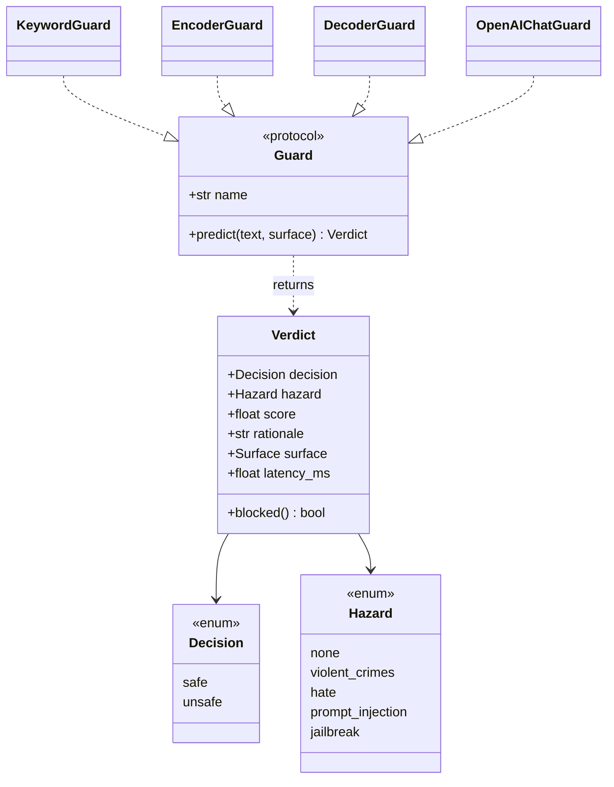

- **`taxonomy.Hazard`** — one canonical label space (MLCommons-aligned content hazards +
  two agent-specific surfaces: `prompt_injection`, `jailbreak`).
- **`schema.Verdict`** — the I/O contract (`decision`, `hazard`, `score`, `rationale`, …).
- **`guard.Guard`** — a `Protocol`; anything with `.name` + `.predict()` is a guard.

---

## 3 · Repository map

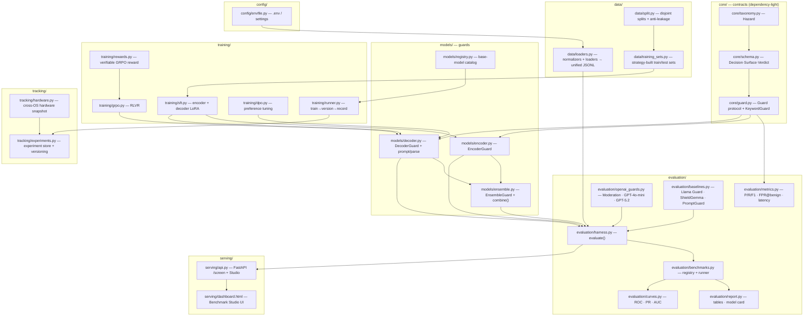

| Module                   | Role                                                                                            |
| ------------------------ | ----------------------------------------------------------------------------------------------- |
| `core/taxonomy`        | single hazard label space (content + injection/jailbreak)                                       |
| `core/schema`          | the`Verdict` contract every guard returns                                                     |
| `core/guard`           | `Guard` protocol + dependency-free reference `KeywordGuard`                                 |
| `config/envfile`       | auto-loads`.env` (OPENAI_API_KEY, HF_TOKEN) into the environment                              |
| `data/loaders`         | dataset loaders/normalizers → unified taxonomy (train sets**and** benchmarks)            |
| `data/split`           | deterministic train/test split +**anti-leakage** guards                                   |
| `data/training_sets`   | training-set**strategies** (balanced / mixed / over-refusal-aware / red-team)             |
| `models/*`             | trained guards:`EncoderGuard` (BERT), `DecoderGuard` (Qwen3/…), `ensemble`, `registry` |
| `models/registry`      | base-model catalog (Qwen3, DeepSeek-R1, SmolLM2, Gemma, …) + techniques                        |
| `models/ensemble`      | `EnsembleGuard` + pure `combine()` (union/intersection/majority/mean/weighted)              |
| `training/*`           | `sft.py`, `grpo.py`, `dpo.py`, `rewards.py` (label = reward), `runner.py`             |
| `training/runner`      | train→version→record and leakage-checked test→record orchestration                           |
| `evaluation/*`         | `metrics`, `harness`, benchmark registry, OpenAI + incumbent guards, ROC/AUC, reports       |
| `tracking/experiments` | experiment store + model versioning (JSON, no server)                                           |
| `tracking/hardware`    | CPU/GPU/memory/runtime snapshot per run (cross-OS)                                              |
| `serving`              | FastAPI`/screen` API **and** the Benchmark Studio dashboard (train/test/experiments)    |

---

## 4 · Data layer — one taxonomy, many sources

Each dataset labels harm in its own scheme. Pure **normalizer** functions map every source
onto one record shape — `{"text", "label", "hazard", "source"}` — so training and evaluation
are comparable across datasets. Normalizers are unit-tested with no network; **loaders** add
the Hugging Face download on top (lazy import).

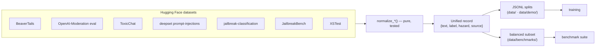

- **Positive class = `unsafe`.** Labels normalize to `safe` / `unsafe`; the hazard is a
  best-effort category (it doesn't affect binary P/R/F1).
- **Splits are deterministic** (`train_val_split`, `seed=42`). The `beavertails` benchmark uses
  the held-out `30k_test` split — disjoint from the demo training data (no leakage).
- **Gated sets** (WildGuardMix, HarmBench, AdvBench, Lakera PINT) need `HF_TOKEN`; the suite
  reports them as *not run* rather than fabricating numbers.

---

## 5 · Guards — three regimes + baselines

All guards implement the same `Guard` interface, so they drop into one harness.

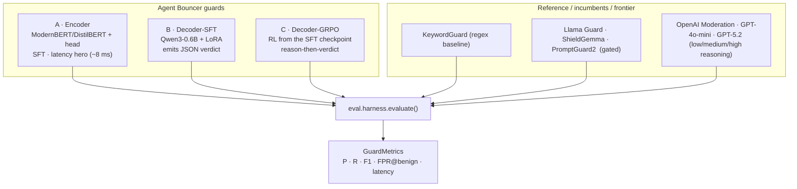

| Regime                      | Model             | Idea                                            | Trade-off                                         |
| --------------------------- | ----------------- | ----------------------------------------------- | ------------------------------------------------- |
| **A — Encoder**      | DistilBERT 66M    | safety as classification                        | fastest (~8 ms), continuous score → real ROC/AUC |
| **B — SFT decoder**  | Qwen3-0.6B (LoRA) | instruction-style`safe/unsafe + hazard` JSON  | generalizes better, ~500 ms on CPU                |
| **C — GRPO decoder** | Qwen3-0.6B (RL)   | reason-then-verdict,**verifiable reward** | RLVR on top of SFT                                |

The decoder's **prompt / target / parse** format lives in one place (`models/decoder.py`) so
SFT, GRPO, DPO, and inference never drift. `build_prompt` → model → `parse_verdict` → `Verdict`;
unparseable output **fails closed** (treated as unsafe).

---

## 6 · Training — SFT, DPO, and RL (GRPO / RLVR)

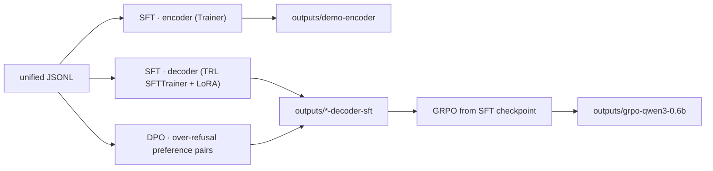

The headline experiment is **RLVR**: a guardrail has ground-truth labels, so the **label is the
reward** — no reward model needed.

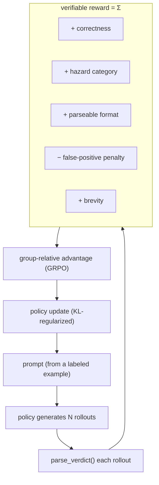

The **false-positive penalty** bakes the headline metric (don't over-block benign traffic)
directly into the objective. Reward functions are pure and unit-tested; the LoRA adapter is
merged after training so the RL model loads as a standalone guard, exactly like SFT.

---

## 6b · Training & experiment lifecycle

A dedicated training subsystem turns "run a script" into a tracked, reproducible,
**versioned** experiment — for any model in the registry (the Qwen3 SLMs plus
**DeepSeek-R1-1.5B, SmolLM2-1.7B, Gemma-1B**), with the same SFT + RL techniques.

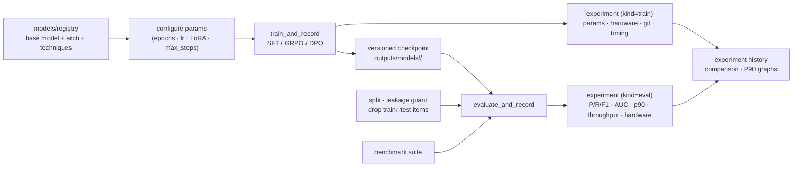

- **Model registry** (`models/registry.py`) — base models + arch + supported techniques.
- **Versioning** (`tracking/experiments.py`) — every train writes `outputs/models/<key>/<version>/`.
- **Experiment store** — one JSON per run under `outputs/experiments/` + an index; captures
  params, dataset, **hardware** (`tracking/hardware.py`: CPU/GPU/memory/runtime), git commit, and metrics.
- **Dataset separation** (`data/split.py`) — deterministic disjoint splits + `assert_no_leakage`;
  at test time, any benchmark prompt found in the model's *training* data is **dropped and
  reported**, so a model is never scored on what it trained on.
- **Orchestration** (`training/runner.py`) — `train_and_record` / `evaluate_and_record`, driven
  by `scripts/train/run_training.py`, `scripts/eval/run_testing.py`, and the Studio's `/api/train` `/api/test`.

## 7 · Evaluation harness & the benchmark suite

One harness scores any guard on any labeled set; the benchmark suite is a **registry** of
standard datasets wired to that harness.

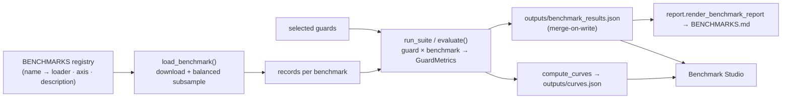

Three axes are covered: **guardrail** (BeaverTails, OpenAI-Moderation, ToxicChat),
**red-teaming** (deepset prompt-injections, jailbreak-classification, JailbreakBench), and
**over-refusal** (XSTest). Every guard is scored on the *same* balanced subset per benchmark.

---

## 8 · Metrics & curves

`UNSAFE` is the positive class. Definitions in `evaluation/metrics.py` / `evaluation/curves.py`:

| Metric                            | Meaning                                                                        | Direction          |
| --------------------------------- | ------------------------------------------------------------------------------ | ------------------ |
| **Precision**               | of flagged prompts, how many were truly unsafe                                 | higher ↑          |
| **Recall**                  | of unsafe prompts, how many were caught                                        | higher ↑          |
| **F1**                      | harmonic mean of precision & recall                                            | higher ↑          |
| **`fpr_on_benign`**       | share of*benign* prompts wrongly blocked (**over-blocking**)           | **lower ↓** |
| **p50 / p90 / p95 latency** | per-request cost;**p90** is the tail-latency SLO number                  | lower ↓           |
| **throughput**              | single-stream queries/sec (1000 / mean latency)                                | higher ↑          |
| **ROC-AUC**                 | ranking quality; swept for continuous scores, single-operating-point otherwise | higher ↑          |

`fpr_on_benign` is first-class because over-blocking is what makes a guardrail unusable in
production — and it's the number incumbents underreport. It is also baked into the GRPO reward.

---

## 9 · Serving & the Benchmark Studio

`serving/api.py` exposes the guard as `POST /screen` **and** serves the Benchmark Studio — a
web UI to **browse benchmark contents**, **build training sets** (by strategy), **train /
test** SLM guards (streamed live), and **compare experiments** with hardware + P90 graphs.
Tabs: Overview · Benchmarks · Datasets · Train & Test · Experiments · ROC & AUC.

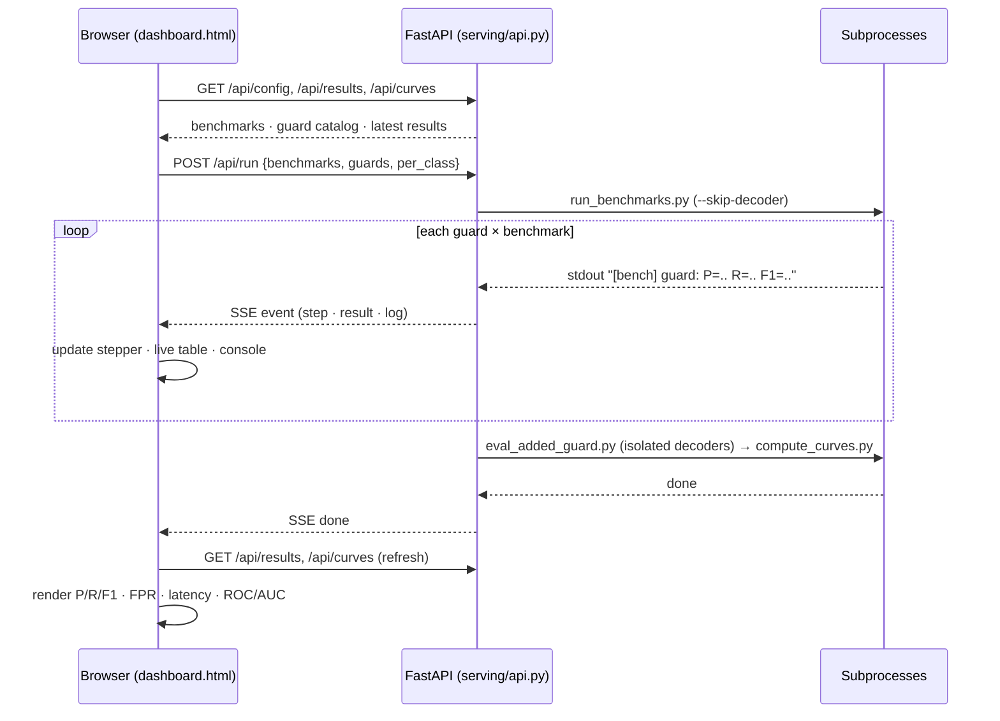

Design choices that keep it robust: **process isolation** (a BERT encoder and a Qwen decoder
co-loaded in one process can deadlock the tokenizer thread-pool, so decoders run in their own
subprocess); **merge-on-write** (a partial run augments the scoreboard instead of clobbering
it); and **Chart.js vendored locally** (works offline).

---

## 10 · Reproducing end-to-end

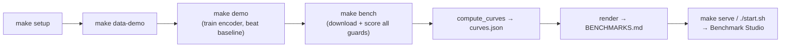

Everything is seeded and deterministic; benchmark subsets are cached; API guards are skipped
(never faked) when a key is absent. The notebook
[`notebooks/agent_bouncer_studio.ipynb`](../notebooks/agent_bouncer_studio.ipynb) drives the
same path from a single file.

---

## 11 · Extending it

- **Add a benchmark** — write a pure `normalize_*` in `data/loaders.py` (+ a loader), register a
  `Benchmark(name, loader, axis, description)` in `evaluation/benchmarks.py`. It flows into the
  suite, the report, and the dashboard automatically.
- **Add a guard** — implement `.name` + `.predict(text, *, surface) -> Verdict`. It's
  immediately scorable and comparable.
- **Add a dataset for training** — a `normalize_*` + loader, then point a training config's
  `data:` at the JSONL.
- **Tune the reward** — edit `RewardWeights` (e.g. raise `false_positive_penalty` to push
  over-blocking down further).
