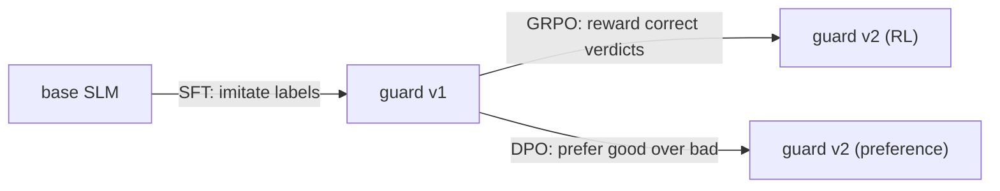
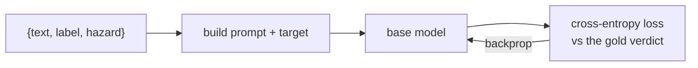
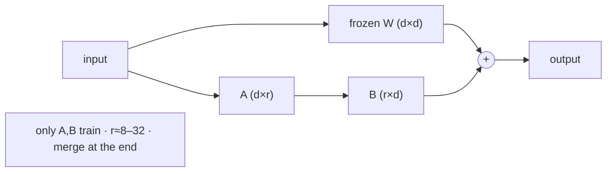
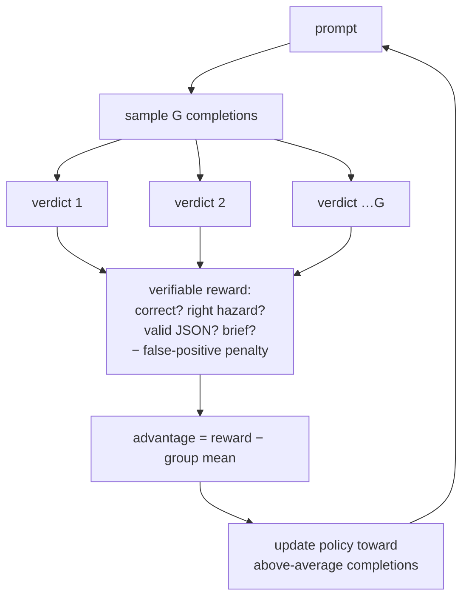
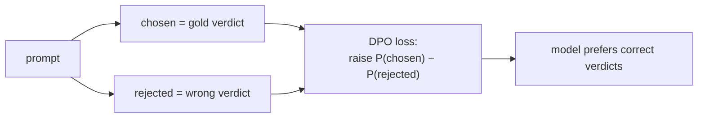
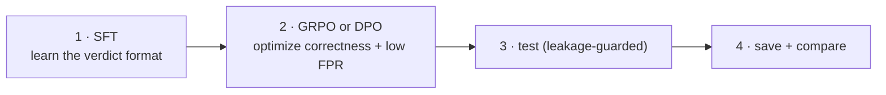

# Fine-tuning techniques — SFT · LoRA · GRPO · DPO

> **Who this is for.** Students and engineers learning how to *turn a base SLM into a safety
> guard*. Each technique is explained with a diagram, the intuition, when to reach for it, and
> where it lives in this repo. Pair this with the [SLM architecture guide](slm-architectures.md).

Every guard in Agent Bouncer returns the same typed **`Verdict`** (`{decision, hazard, score}`).
Training is just *teaching a base model to produce that verdict well* — cheaply, without
over-blocking. There are three tools for the job, plus the parameter-efficient trick (LoRA) that
makes them affordable on a laptop.

---

## SFT — Supervised Fine-Tuning (the workhorse)

**Idea.** Show the model labeled examples and train it to reproduce the right answer with
ordinary next-token (or classification) loss. This is the foundation; GRPO and DPO refine an
SFT model.

- **Encoder path** — a sequence-classification head over `[CLS]`; loss on safe/unsafe. Fast,
  runs on CPU/MPS. → [`training/sft.py::train_encoder`](../src/agent_bouncer/training/sft.py)
- **Decoder path** — teach the model to *emit the JSON verdict* after the prompt; loss on the
  target tokens. → [`training/sft.py::train_decoder`](../src/agent_bouncer/training/sft.py)

**Reach for SFT when:** you have labels (you do — the benchmarks). It's always step one.

---

## LoRA — the efficiency trick behind decoder training

Full fine-tuning updates *all* weights (GBs of optimizer state). **LoRA (Low-Rank Adaptation)**
freezes the base model and injects tiny trainable low-rank matrices **A·B** into each attention/
MLP projection. You train ~0.1–1% of the parameters, then **merge** them back so the guard loads
as a normal standalone model.

Knobs you'll see in the Workbench / configs: `lora_r` (rank), `lora_alpha` (scaling), `dropout`.
Higher `r` = more capacity + more compute. → [`training/runner.py::build_config`](../src/agent_bouncer/training/runner.py)

---

## GRPO — RL from a *verifiable* reward

**Idea.** After SFT, improve the guard with reinforcement learning — but instead of training a
separate (expensive, gameable) reward model, we use a **verifiable reward: the ground-truth label
*is* the reward.** This is RLVR (RL from Verifiable Rewards). **GRPO (Group Relative Policy
Optimization)** samples several completions per prompt, scores each, and pushes the policy toward
the ones that beat the group average — no value network needed.

The reward is a weighted sum you can tune ([`training/rewards.py`](../src/agent_bouncer/training/rewards.py)):

| Component | Rewards… |
|---|---|
| `correctness` | matching the gold decision |
| `category` | naming the right hazard |
| `format` | emitting parseable JSON |
| **`false_positive_penalty`** | **subtracts** for blocking benign traffic (fights over-refusal) |
| `brevity` | short rationales (latency!) |

**Reach for GRPO when:** you want to *directly optimize the metric that matters* (correct,
non-over-blocking verdicts) and, for reasoning models like DeepSeek-R1-Distill, shape the
think-then-answer behavior. Decoders only. → [`training/grpo.py`](../src/agent_bouncer/training/grpo.py)

---

## DPO — Direct Preference Optimization (over-refusal focus)

**Idea.** Instead of a reward loop, give the model **pairs**: a *chosen* (good) and *rejected*
(bad) response to the same prompt, and directly optimize it to prefer the chosen one. Simpler and
more stable than full RL. We build pairs where the **chosen** verdict is the gold one and the
**rejected** is its flip — especially useful to teach "benign → don't block."

**Reach for DPO when:** you have clear good/bad pairs and want targeted correction (e.g. an
over-blocking guard) without standing up an RL loop. Decoders only.
→ [`training/dpo.py`](../src/agent_bouncer/training/dpo.py)

---

## Which technique for which model?

The UI **greys out invalid combinations**; the backend enforces the same matrix
([`registry.assert_valid_combo`](../src/agent_bouncer/models/registry.py)).

| Model | Arch | SFT | GRPO | DPO | Why |
|---|---|:--:|:--:|:--:|---|
| `distilbert` | encoder | ✅ | — | — | classifier: no generation to reward/prefer |
| `qwen3-0.6b` | decoder | ✅ | ✅ | ✅ | full toolkit |
| `qwen3-1.7b` | decoder | ✅ | ✅ | ✅ | full toolkit |
| `deepseek-r1-1.5b` | decoder | ✅ | ✅ | ✅ | reasoning-distilled → shines with GRPO |
| `smollm2-1.7b` | decoder | ✅ | ✅ | ✅ | full toolkit |

**Encoders support SFT only** — GRPO/DPO operate on *generated sequences*, and a classification
head doesn't generate. This isn't a limitation to work around; it's the reason the encoder is the
fast gate and decoders are the flexible reasoners.

---

## A typical recipe

1. **SFT** a decoder to emit valid JSON verdicts.
2. **GRPO** (or **DPO**) to push correctness up and over-blocking down.
3. **Test** on held-out benchmarks — any training prompt found in the test set is dropped and
   reported (no leakage).
4. **Save** the versioned model with its metrics and **compare** experiments.

All four steps are one click each in the [guided workflow →](workflow.md).

## Extending beyond SFT / GRPO / DPO — the right order for this repo

The repo ships **SFT · GRPO · DPO**. The key fact that fixes the *order* of any extension: our reward is
**verifiable** — the gold `safe`/`unsafe` label *is* the reward — so the natural progression stays in the
**reward-model-free** family (critic-free online RL, reference-free preference) and reserves anything that
needs a *learned* reward model for last. Concretely:

**SFT → GRPO → DPO → RLOO → ORPO → (maybe) KTO → [RewardTrainer + PPO, only if going reward-model-based].**

| Technique | Family | Needs | TRL trainer | Reach for it when |
|---|---|---|---|---|
| **SFT** | supervised | labels | `SFTTrainer` | always step 1 |
| **GRPO** | online RL, critic-free (group-relative baseline) | a verifiable reward | `GRPOTrainer` | optimize the metric directly |
| **DPO** | offline preference (needs a reference model) | good/bad pairs | `DPOTrainer` | targeted correction from pairs |
| **RLOO** | online RL, critic-free (leave-one-out baseline) | a verifiable reward | `RLOOTrainer` | a lighter online-RL sibling of GRPO — try when GRPO is unstable/costly |
| **ORPO** | reference-free preference **fused with SFT** (one stage) | good/bad pairs | `ORPOTrainer` | no reference model in memory; efficient one-pass align for small models |
| **KTO** *(maybe)* | unpaired, binary desirable/undesirable | per-example `safe`/`unsafe` (no pairs) | `KTOTrainer` | you have lots of *unpaired* good/bad examples — which guardrail data naturally is |
| **RewardTrainer + PPO** | reward-model-based RLHF | a trained reward model + value model | `RewardTrainer`, `PPOTrainer` | **only** if you deliberately move to reward-model-based RL |

**Why this order (not the textbook RLHF ladder):** when the reward is exact, RLOO/ORPO/KTO stay
reward-model-free and cheap, while `RewardTrainer + PPO` add a whole reward-model training stage plus a
value network that buy little over a verifiable reward — so they come **last**, and only on purpose.
GRPO and RLOO are siblings (group-relative vs leave-one-out baseline, both critic-free); ORPO folds the
preference signal into SFT so there's no separate reference model; KTO is the natural fit for our binary,
often-unpaired labels. Encoders remain **SFT-only** — all of these operate on generated sequences.

*(Only SFT/GRPO/DPO are wired today; RLOO/ORPO/KTO are the planned extensions and would each add a thin
TRL-trainer wrapper alongside `training/sft.py` · `grpo.py` · `dpo.py`.)*
