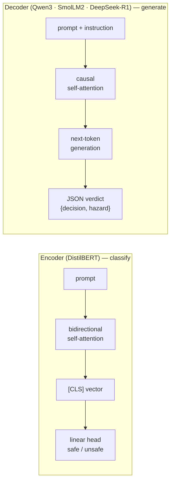
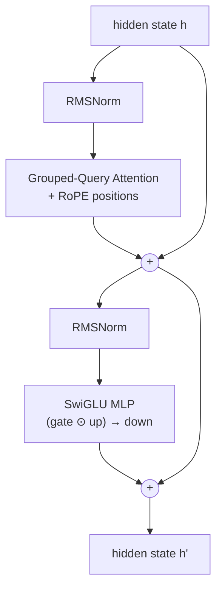
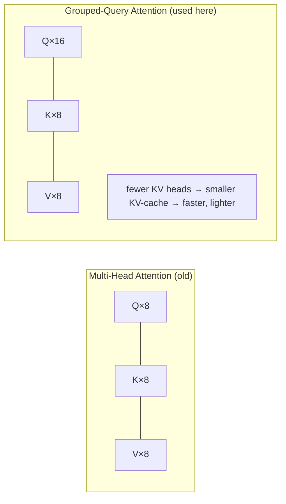
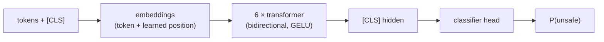
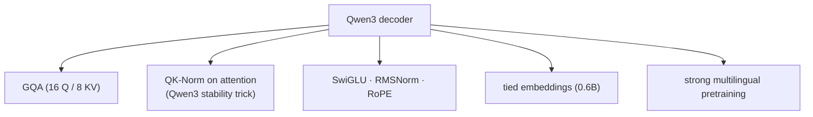
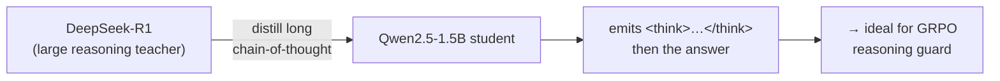
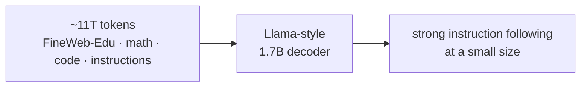
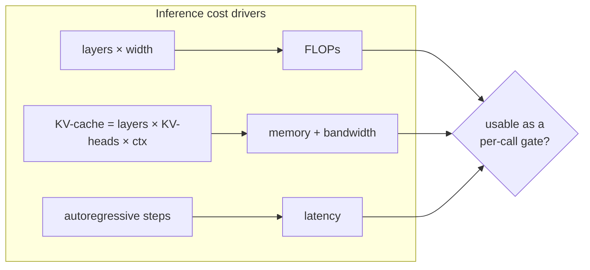

# SLM Architectures — a visual guide for guardrail engineering

> **Who this is for.** Students and engineers who want to understand *what's inside* the
> small language models (SLMs) this project fine-tunes into safety guards — and *why* the
> architecture matters when your model must run on **every** request. Every claim below is
> tied to the model's published card; config numbers are indicative of the released checkpoints.

A guardrail runs on the hot path, so we care about three things a general chatbot doesn't
obsess over: **latency**, **memory**, and **calibration** (not over-blocking). Architecture
drives all three. This guide builds up from the shared transformer skeleton, then dives into
each model in the [registry](../src/agent_bouncer/models/registry.py).

---

## 1 · Two shapes of model: encoder vs decoder

Agent Bouncer uses **both** families, because safety can be framed two ways.

| | **Encoder** (BERT-family) | **Decoder** (GPT-family) |
|---|---|---|
| Attention | **Bidirectional** (sees whole prompt at once) | **Causal** (left-to-right) |
| Output | One classification per input | A generated token sequence (our JSON verdict) |
| Speed | **Fastest** — one forward pass | Slower — autoregressive decoding |
| Strength | Cheap, calibrated probability | Explains *why*, generalizes, can reason |
| Trains with | SFT only | SFT · **GRPO** · **DPO** |

**Design consequence.** The encoder is the *latency hero* (a per-call gate); decoders are the
*quality/flexibility* option and the only ones you can RL-tune. That split is enforced by the
[technique matrix](fine-tuning.md#which-technique-for-which-model).

---

## 2 · The modern decoder block (shared skeleton)

Qwen3, SmolLM2, and DeepSeek-R1-Distill are all **decoder-only transformers** built from the
same post-Llama recipe. One block:

Four ideas do the heavy lifting — worth knowing by name:

- **RMSNorm** — normalizes by root-mean-square only (no mean-subtraction, no bias). Cheaper and
  as stable as LayerNorm; applied *pre*-attention and *pre*-MLP ("pre-norm").
- **RoPE (Rotary Position Embedding)** — encodes position by *rotating* query/key vectors, so
  relative distance is baked into the dot-product. Extrapolates to longer contexts (YaRN/scaling).
- **GQA (Grouped-Query Attention)** — many query heads **share** a smaller set of key/value
  heads. This shrinks the **KV-cache** (the dominant memory + bandwidth cost at inference), which
  is exactly what makes small decoders fast enough to gate traffic.
- **SwiGLU MLP** — a gated feed-forward (`(xW_gate) ⊙ SiLU(xW_up)` then `W_down`). Better quality
  per parameter than plain ReLU MLPs; uses three projection matrices instead of two.

Stack *N* of these blocks, add a token embedding at the bottom and a projection to the
vocabulary at the top (often **tied** to the embedding on small models to save parameters), and
you have the model. What differs between our SLMs is **how many** blocks, **how wide**, the
**head grouping**, and — crucially — **what they were trained on**.

---

## 3 · The registry, side by side

Indicative configuration of the released checkpoints (see each model card for exact values):

| Model | Family | Params | Layers | Hidden | Q / KV heads | Vocab | Context | In registry |
|---|---|--:|--:|--:|--:|--:|--:|---|
| **DistilBERT** | BERT (encoder) | 66M | 6 | 768 | 12 / 12 | 30k | 512 | `distilbert` |
| **Qwen3-0.6B** | Qwen3 | 0.6B | 28 | 1024 | 16 / 8 | 151k | 32k | `qwen3-0.6b` |
| **Qwen3-1.7B** | Qwen3 | 1.7B | 28 | 2048 | 16 / 8 | 151k | 32k | `qwen3-1.7b` |
| **DeepSeek-R1-Distill-Qwen-1.5B** | Qwen2.5 | 1.5B | 28 | 1536 | 12 / 2 | 151k | 128k | `deepseek-r1-1.5b` |
| **SmolLM2-1.7B** | Llama-style | 1.7B | 24 | 2048 | 32 / 32 | 49k | 8k | `smollm2-1.7b` |

*(Q/KV heads = query heads / key-value heads; the gap is the GQA grouping.)*

---

## 4 · Model-by-model

### DistilBERT — the latency hero (encoder)

DistilBERT is BERT **distilled** to 6 layers (~40% smaller, ~60% faster, ~97% of BERT's GLUE).
It is **bidirectional** and **encoder-only**: it reads the whole prompt and emits one vector,
which a small head turns into a safe/unsafe probability. No autoregressive decoding → **single
forward pass → millisecond latency on CPU**. That's why it's the default per-call gate. The
trade-off: it classifies but can't *explain* or *reason*, and it only supports **SFT**.
→ [`models/encoder.py`](../src/agent_bouncer/models/encoder.py)

### Qwen3-0.6B & 1.7B — the balanced workhorses (decoder)

Qwen3 is a modern, well-documented dense decoder. Beyond the shared skeleton it adds **QK-Norm**
(normalizing queries/keys before attention) for training stability, and ships in a family that
spans 0.6B → 235B, so the **same recipe** scales. For us:

- **0.6B** — the smallest capable JSON-emitting guard. Fast on Apple MPS, trainable on a laptop.
  Our default decoder guard and GRPO subject.
- **1.7B** — more capacity (wider, 2048 hidden) for harder red-teaming, at higher latency/memory.

Both support **SFT / GRPO / DPO**. → [`models/decoder.py`](../src/agent_bouncer/models/decoder.py)

### DeepSeek-R1-Distill-Qwen-1.5B — the reasoning specialist (decoder)

This is a **Qwen2.5-1.5B** base **distilled on reasoning traces** from DeepSeek-R1. Architecturally
it's a Qwen2.5 decoder (note the aggressive GQA: **12 query heads share just 2 KV heads** → a very
small KV-cache), but its *behavior* is the selling point: it natively produces long
chain-of-thought before answering. That makes it a natural fit for the **GRPO reasoning guard**,
where the model thinks briefly, then emits the verdict — and the verifiable reward shapes both the
answer *and* the brevity of the reasoning. → [Fine-tuning: GRPO](fine-tuning.md#grpo--rl-from-a-verifiable-reward)

### SmolLM2-1.7B — the data-quality contender (decoder)

SmolLM2 is a **Llama-architecture** decoder (RoPE, RMSNorm, SwiGLU, MHA) whose edge is **training
data**: ~11 trillion carefully curated tokens (education-heavy web, math, code, synthetic
instructions). It shows that at the small scale, **data quality rivals architectural novelty**.
Smaller vocab (49k) and 8k context keep it lean. Supports **SFT / GRPO / DPO**.

---

## 5 · Why this matters for a guard

- **Encoder (DistilBERT):** one pass, no KV-cache, tiny → **yes, per-call gate**.
- **Small decoder (Qwen3-0.6B):** short JSON output + GQA → **borderline**, great on MPS/GPU.
- **Larger decoders (1.5–1.7B):** more capacity, more latency → **async / higher-value checks**.

The [benchmark scoreboard](benchmarks.md) quantifies exactly this trade-off (macro-F1 vs
`fpr_on_benign` vs p50/p90 latency), and the [Studio](index.md) lets you **train each of these
models yourself** and compare them on identical data.

**Next:** [Fine-tuning techniques →](fine-tuning.md) · [The guided workflow →](workflow.md)
