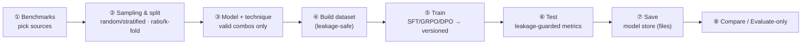

# The guided training & evaluation workflow

An end-to-end, guided path from **benchmark → sampling → model + technique → train → test →
save → compare**. Every step is available in the **Benchmark Studio** (`./start.sh`) and via the
API/CLI. The Studio's tabs mirror the flow: **Overview** (scoreboard), **Explore Benchmarks**,
**Datasets Creation**, **Train & Test**, **Experiments**, and **Leaderboard** (macro-average
results table, ROC/PR/AUC curves, a **Generate PDF report** button, and an **interactive ensemble
builder**). Invalid choices are prevented, and train/test separation is guaranteed.

## 1 · Benchmark selection

Choose one or more of the [7 standard benchmarks](benchmarks.md) (guardrail · red-team ·
over-refusal). `GET /api/config` lists them; the Workflow tab shows them as chips. The
**Benchmarks** tab serves the **full** dataset when it's been downloaded
(`scripts/data/download_full_benchmarks.py` → `data/benchmarks/full/`), with search, safe/unsafe
filter, and *Load more* paging — so you can explore every prompt, not just a sample.

## 2 · Sampling & split

Two orthogonal choices, exposed at `GET /api/sampling`
([`data/sampling.py`](../src/agent_bouncer/data/sampling.py)):

- **Sampling** — how to *draw* examples: `random` (uniform) or `stratified` (preserve the
  safe/unsafe balance — recommended for imbalanced sets).
- **Split** — how to *divide* them: a **ratio** (e.g. 70/30, 80/20) or **k-fold**
  cross-validation (K disjoint folds, each held out once).

Every split is **de-duplicated and asserted leakage-free** before use.

## 3 · Model & technique

Pick a base model from the [registry](slm-architectures.md#3--the-registry-side-by-side) and a
[technique](fine-tuning.md). The UI **greys out invalid pairings** using the validity matrix from
`GET /api/models` (`matrix`); the backend re-checks with `assert_valid_combo`. Encoders → SFT
only; decoders → SFT/GRPO/DPO.

## 4–6 · Build → Train → Test

- **Build** a leakage-safe training set (`POST /api/dataset/build`, strategy + holdout).
- **Train** the chosen model+technique to a **versioned** checkpoint (`POST /api/train`) — streamed
  live over Server-Sent Events.
- **Test** against the selected benchmarks with **leakage guards** (`POST /api/test`): any test
  prompt found in the model's training data is dropped and reported. Metrics are **per-benchmark**
  and **macro-averaged**: precision, recall, F1, ROC-AUC, `fpr_on_benign`, latency (p50/p90),
  throughput.

## 7 · Save (model persistence)

Trained models are persisted to the **model store**
([`tracking/model_store.py`](../src/agent_bouncer/tracking/model_store.py)) — the **filesystem**
(default: one JSON per model) or **SQLite** — with full metadata: source benchmarks, sampling
strategy, split, technique, evaluation metrics, version, timestamp, git commit, and the weights
path. Everything (datasets, weights, experiments, results, model records) lives as files on disk.
`GET/POST/DELETE /api/saved_models`.

## 8 · Evaluate-only & compare

- **Evaluate-only** (`POST /api/eval`, *Evaluate* tab): score a **saved** model on any benchmarks
  without retraining — same leakage guards and metrics. → [`runner.eval_only`](../src/agent_bouncer/training/runner.py)
- **Compare**: the *Experiments* tab charts P90 latency and macro metrics across runs; every
  experiment records the **hardware** it ran on for fair cross-machine comparison.

---

## API summary

| Endpoint | Purpose |
|---|---|
| `GET /api/config` | benchmarks + guard catalog |
| `GET /api/sampling` | sampling (random/stratified) + split (ratio/k-fold) strategies |
| `GET /api/models` | base-model catalog + techniques + **validity matrix** |
| `POST /api/dataset/build` | build a leakage-safe training set |
| `POST /api/train` · `POST /api/test` | train a version · test it (leakage-guarded) |
| `GET/POST/DELETE /api/saved_models` | list / persist / delete saved models |
| `POST /api/eval` | evaluation-only on a saved model |
| `GET /api/experiments` | full run history (with hardware) |

Reproduce from the CLI with [`scripts/data/build_dataset.py`](../scripts/data/build_dataset.py),
[`scripts/train/run_training.py`](../scripts/train/run_training.py),
[`scripts/eval/run_testing.py`](../scripts/eval/run_testing.py), and
[`scripts/eval/run_eval_only.py`](../scripts/eval/run_eval_only.py).
