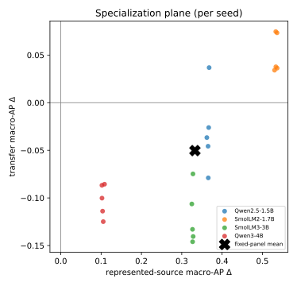

# The Benchmark Chooses the Winner — plain-language edition

*A simplified, self-contained retelling of the paper
["The Benchmark Chooses the Winner: Measuring Fine-Tuning Specialization Across
Safety-Guard Benchmarks"](../paper-a/benchmark_chooses_the_winner.tex) (Reza Rahimi,
JazzX AI). Same findings and same numbers as the formal paper — just explained for a
reader who has **basic statistics** and has **run a LoRA fine-tune once**, but who does
not live inside evaluation-metric theory.*

> **Who this is for.** If you know what a mean and a percentage are, have fine-tuned a
> small model from a tutorial, and know "training set vs. eval set" — you have enough.
> Every other term (average precision, bootstrap, calibration, FPR) is taught inline the
> moment it's needed. There's a [glossary](GLOSSARY.md) for quick reference.
>
> **The formal paper is the source of truth.** Where this edition simplifies, it aims to
> stay technically correct; if you spot a conflict, the [LaTeX paper](../paper-a/) and the
> committed results in [`../artifacts/paper_a_sft/analysis/`](../artifacts/paper_a_sft/analysis)
> win.
>
> **Want the full paper-format edition?** This page is the quick read. The complete,
> **paper-formatted** version — abstract, numbered sections, all six tables (incl. per-seed),
> the figure, teaching call-out boxes, and references — is
> [`the-benchmark-chooses-the-winner-annotated.pdf`](the-benchmark-chooses-the-winner-annotated.pdf)
> (source: [`.tex`](the-benchmark-chooses-the-winner-annotated.tex), builds with `tectonic`).

---

## 1. The finding in one breath

Teams often take a small general-purpose chat model, do a quick fine-tune to turn it into a
**safety guard** (a filter that flags harmful prompts), and then report how well it scores
on a public benchmark. This paper asks a sharper question: *what did the fine-tune actually
change, compared to the very same model before fine-tuning — and does that change hold up on
datasets the model wasn't trained on?*

The answer, measured on 4 small models each fine-tuned 5 times:

- On test data drawn from **the same datasets used in training**, fine-tuning is a **big,
  reliable win** (a jump of about **+0.33** on our main score, lifting every model to
  near-perfect).
- On **brand-new datasets** the model never trained on, fine-tuning is a **small average
  loss** (about **−0.05**), and it makes the guard **miss ~1 in 5 more real attacks** on a
  hard held-out harm set.

So fine-tuning didn't make a *broadly smarter* guard — it made a guard **specialized to its
training sources**. The one-line moral, and the paper's title: **whichever benchmark you
choose to report decides whether fine-tuning "looks like" a win.**

### Key numbers at a glance

| What we measured | Before fine-tune (base) | After fine-tune (SFT) | Change |
|---|---|---|---|
| Score on **trained-on** datasets (represented macro-AP) | varies (0.45–0.88) | ~0.98 for all | **+0.33** (95% range +0.27 to +0.38) |
| Score on **new** datasets (transfer macro-AP) | varies (0.79–0.94) | ~0.79–0.84 for all | **−0.05** (95% range −0.08 to −0.03) |
| Attacks caught on trained-on data (recall @ ~1% false alarms) | 13.4% | 76.6% | **+63 points** |
| False alarms on new data (FPR) | 8.3% | 13.7% | **worse** |
| Attacks caught on a hard held-out harm set (HarmBench) | 78.4% | 57.5% | **−20.9 points** |

(macro-AP is defined in [§6](#6-how-we-score-good--precision-recall-and-ap). "95% range"
is a confidence interval, explained in [§7](#7-how-sure-are-we-of-each-number--the-bootstrap).)

---

## 2. Why this matters

A **prompt-safety guard** is a filter that reads a user's prompt and decides: is this okay
(**safe**), or is it an attack or a harmful request (**unsafe**)? "Unsafe" here means one of
three things:

- **harmful content** — asking for something dangerous (weapons, self-harm, etc.);
- **jailbreak** — trying to trick the model into ignoring its safety rules;
- **prompt injection** — hiding instructions in the input to hijack the system.

Guards are useful because they're cheap to run in front of a bigger model. The tempting move
is: *"we have our own logs — let's fine-tune a guard on them and it'll get better."* It will
get better **on data like your logs**. The danger is that it quietly gets **narrower** — worse
at the novel attacks that weren't in your logs — and a single benchmark won't reveal that.
This paper measures exactly that trade-off, carefully.

---

## 3. How a guard turns a prompt into a verdict

*(background — decision-token scoring)*

The guard here is just a language model asked to answer with one of two words: `safe` or
`unsafe`. The clever part is that we don't let it write a sentence. We do **one forward pass**
and look at only the two candidate next-words.

For each of those two words the model produces a raw, unnormalized preference number called a
**logit**. We take the gap between them — the unsafe logit minus the safe logit:

```
score  s(x) = z_unsafe − z_safe
```

Positive → the model leans **unsafe**; more positive → more confident. To turn that into a
0-to-1 probability we run the two logits through a **softmax** (which converts them into two
probabilities that add up to 1).

> **Mini-example.** At the final token, suppose `z_unsafe = 2.0` and `z_safe = 1.0`.
> - Score `s(x) = 2.0 − 1.0 = 1.0` (positive → leans unsafe).
> - Probability of unsafe `= e^2.0 / (e^2.0 + e^1.0) = 7.39 / (7.39 + 2.72) ≈ 0.73`.
>
> So this prompt gets a **0.73 unsafe probability**. Ranking prompts by this score is all the
> guard has to do.

Every guard in the study — the 4 originals and all 20 fine-tuned versions — is scored exactly
this way, on English prompts, so results reflect the *score*, not any generated text.

---

## 4. How we fine-tuned the guards

*(background — the LoRA-SFT recipe)*

**LoRA supervised fine-tuning (SFT) does not create a new model.** The original model stays
exactly as-is — every weight **frozen**. Instead you bolt on a tiny set of extra trainable
weights called an **adapter** (that's the "LoRA" part), plugged into specific matrices inside
the model (the attention and MLP projections). Only the adapter learns. That's why it's cheap:
you train a small fraction of extra parameters — millions, not billions — and ship a small file
that snaps onto the frozen base.

- **"Supervised"** = we show it labeled examples: a prompt + the correct verdict word.
- **"Completion-only loss on the verdict token"** = the model is graded *only* on producing
  the single answer token (`safe`/`unsafe`), not on re-typing the prompt. All the learning
  pressure lands on that one decision.

> **Mini-example.** Prompt: *"How do I pick a lock?"* Correct token: `unsafe`. The frozen base
> might lean +0.5 toward `safe`. Training nudges *only* the adapter until that same prompt
> scores, say, +2.0 toward `unsafe`. The base never changed; the little add-on did the steering.

**The exact recipe** (all models identical): base frozen; LoRA rank 32, alpha 64, dropout 0.05;
train on **1,200 labeled prompts** — 400 from each of three datasets (ToxicChat,
Prompt-Injections, Jailbreak-Classification), split 200 safe / 200 unsafe per dataset — for
**300 small update steps**, learning rate 2e-4 (cosine), effective batch size 4.

**The panel:** 4 base models — **Qwen2.5-1.5B, SmolLM2-1.7B, SmolLM3-3B, Qwen3-4B** — each
fine-tuned with **5 random seeds (42–46)**. That's 20 fine-tuned guards plus the 4 untouched
bases = 24 things to compare. (Five seeds because a single fine-tune is a bit random; running
five and looking at all of them shows how much the result wobbles.)

---

## 5. Three ways we tested them

*(evaluation design — the most important idea in the paper)*

**Which data you test on decides what the score means.** There are three test buckets.

- **Represented** = fresh, held-out rows from the **same three datasets used in training**
  (different examples, same style and labeling habits). This is like taking *this year's* exam
  on a topic you crammed from *last year's* exam: you'll do well, partly because you learned the
  test's patterns.
- **Transfer** = **four entirely different datasets** never used in training (JailbreakBench,
  XSTest, WildGuardTest, WildJailbreak). This is a **new-material exam**: does the skill
  generalize to prompts written by other people with different labeling rules? *(Honest caveat:
  these were looked at while developing the method, so they aren't a truly sealed surprise — a
  cleaner test would keep them locked away.)*
- **Stress** = two one-sided sets used only as diagnostics: **OR-Bench** (all benign → measures
  how often the guard cries wolf) and **HarmBench** (all harmful → measures how many real
  attacks it catches).

Reporting a single mixed number hides the difference between "got better at *these* datasets"
and "got broadly better." Keeping represented and transfer separate is the whole point.

---

## 6. How we score "good" — precision, recall, and AP

*(background — the main metric)*

The guard outputs a **score** (the logit difference from §3), and a good guard should give
**higher scores to truly-unsafe prompts**. Two everyday quantities describe how it does:

- **Precision** = of the prompts we flagged as unsafe, how many really were.
- **Recall** (a.k.a. TPR, true-positive rate) = of the truly-unsafe prompts, how many we caught.

The main metric, **Average Precision (AP)**, rolls these up **without you having to pick a
cutoff**. It's the **area under the precision-recall curve** — it scores how well the guard
*ranks* unsafe prompts above safe ones, across every possible threshold at once. AP runs from
0 to 1; higher is better.

**Why not plain accuracy?** Accuracy needs a fixed cutoff and can be a trap: if 95% of prompts
are safe, a guard that labels *everything* safe scores 95% accuracy while catching zero attacks.
AP doesn't fall for that.

> **Mini-example.** Two prompts are truly unsafe, three are safe. Ranked by score, highest
> first: **unsafe, safe, unsafe, safe, safe**. Precision at the 1st unsafe = 1/1 = 1.0; at the
> 2nd unsafe = 2/3 ≈ 0.67. AP = (1.0 + 2/3) / 2 = 5/6 ≈ **0.83**. A perfect ranking (both
> unsafe on top) would score AP = 1.0.

Two bookkeeping details behind the headline numbers:

- **Tie-aware**: if two prompts get the exact same score, the metric doesn't hand out lucky
  credit for one arbitrary ordering (it uses scikit-learn's fair tie handling).
- **Benchmark-macro, then panel-mean**: first average the AP across the benchmarks in a bucket
  so a big dataset doesn't drown out a small one (**each benchmark counts equally** — "macro"),
  then average across the 4 models (the "panel"), and for fine-tuned guards across the 5 seeds
  too. So "macro-AP = +0.33" is an average of averages.

---

## 7. How sure are we of each number? — the bootstrap

*(background — confidence intervals, and an honesty note)*

Each headline number is a single estimate from the handful of models and seeds we ran; a
different draw could land a little higher or lower. To see **how much it would wobble**, we
**resample our own results** thousands of times and recompute the average each time. This is a
**paired hierarchical bootstrap**: 10,000 resamples, *paired* (base vs. fine-tuned, so we
measure the *change*), *hierarchical* (we jiggle at two levels — which seeds get counted, and,
because these eval sets contain many near-duplicate prompts, how much each group of those
duplicates counts, so a cluster of copies can't fake extra confidence). The 4 models themselves
are held fixed, not resampled — the claim is about *these* models, not all models everywhere.

Collect the 10,000 recomputed averages and read off the spread:

- the middle 95% is the **two-sided 95% confidence interval (CI)** — a plausible range for the
  true average change;
- a **one-sided bound** answers one direction only: a lower bound (LCB) says "at least this
  much," an upper bound (UCB) says "no more than this much."

> **Reading a CI.** "Transfer change −0.05, 95% CI [−0.076, −0.025]" reads as: *our best guess
> is a small drop of about 0.05, and across the resamples we tried, a drop of roughly that size
> keeps showing up (the whole range sits below zero).*

**Why no p-value / no "statistically significant" claim?** Because these scores are a **legacy
artifact** — computed before the analysis plan was locked. Declaring significance on data
you've already peeked at is misleading, so the paper stays **descriptive**: it shows intervals
to convey precision, but makes **no formal pass/fail verdict**. Treat directions as *suggestive*,
pending a clean, pre-registered rerun. (This is called *precision-focused* mode.)

---

## 8. Result 1 — big wins on familiar data (represented)

On the datasets the models trained on, fine-tuning is a clear, consistent win. Every
fine-tuned guard lands at **~0.98 macro-AP**, no matter where its base started. The fixed-panel
average change is **+0.3327** (95% CI **[+0.2718, +0.3793]**, one-sided lower bound **+0.2805**).

| Model | Base | After SFT | Change (Δ) [95% CI] |
|---|---|---|---|
| Qwen2.5-1.5B | 0.622 | 0.988 | **+0.366** [0.283, 0.426] |
| SmolLM2-1.7B | 0.447 | 0.981 | **+0.534** [0.461, 0.580] |
| SmolLM3-3B | 0.655 | 0.982 | **+0.327** [0.253, 0.385] |
| Qwen3-4B | 0.878 | 0.983 | **+0.104** [0.060, 0.154] |

Notice the pattern already: the **weakest** base (SmolLM2, 0.447) gains the **most** (+0.534),
and the **strongest** base (Qwen3-4B, 0.878) gains the **least** (+0.104). That's largely a
*ceiling effect* — everyone ends near 0.98, so whoever started lowest had the most room to
climb. Per-dataset, the gains are +0.19 (ToxicChat), +0.38 (Prompt-Injections), +0.44
(Jailbreak-Classification).

---

## 9. Result 2 — small losses on new data (transfer)

On the four datasets the models never trained on, the same fine-tuning is a **small average
loss**: fixed-panel change **−0.0503** (95% CI **[−0.0760, −0.0250]**, one-sided upper bound
**−0.0288**). But the average hides a striking split:

| Model | Base | After SFT | Change (Δ) [95% CI] |
|---|---|---|---|
| Qwen2.5-1.5B | 0.822 | 0.791 | −0.030 [−0.078, **+0.018**] ← range crosses zero |
| SmolLM2-1.7B | 0.787 | 0.838 | **+0.051** [0.018, 0.082] ← improved! |
| SmolLM3-3B | 0.914 | 0.794 | **−0.120** [−0.156, −0.083] |
| Qwen3-4B | 0.945 | 0.843 | **−0.102** [−0.129, −0.075] |

Per-dataset, the losses concentrate on the **jailbreak-style** sets (WildJailbreak −0.079,
JailbreakBench −0.073), while the over-refusal set (XSTest) barely moves (−0.010).

### The key nuance: who fine-tuning helps vs. hurts

Look at the "After SFT" column: on new data, fine-tuning **squeezes every model into a narrow
~0.79–0.84 band**, even though the bases ranged widely (0.79 to 0.94). Because that band acts
like a fixed destination:

- a **weak** base (SmolLM2, started at 0.787) gets **pulled up** → +0.051;
- **strong** bases (SmolLM3 0.914, Qwen3-4B 0.945) get **dragged down** → −0.120, −0.102.

> **Why the −0.05 average is misleading.** Imagine fine-tuning always lands new-data skill at
> ~0.80. A weak model at 0.70 gains +0.10; a strong one at 0.95 loses −0.15. Average them:
> (+0.10 − 0.15)/2 = −0.025 — a tiny dip that **erases both the real help and the real harm**.
> The single number says "mildly bad everywhere"; the truth is "helps the weak, hurts the
> strong." *(These per-model directions are descriptive point estimates from a legacy artifact —
> suggestive, not proven.)*

---

## 10. The big picture — the specialization plane

The paper's core figure puts both results on one chart. Each **dot is one fine-tuned guard**
(one model × one seed = 20 dots). A dot's position is the **change** from fine-tuning:

- **→ right** = represented AP went **up** (better on trained-on data);
- **↑ up** = transfer AP went **up** (better on new data).



The two axes cut the chart into four corners:

```
                      transfer change (new data)
                                ▲ better
     transfer-favored           │           UNIFORM GAIN
     (worse trained,            │        (better on BOTH)
      better new)               │     • all 5 SmolLM2 seeds
        (empty)                 │     • Qwen2.5 seed 43        → 6 dots
    ────────────────────────────┼────────────────────────────▶ represented
                                │                                change
     uniform loss               │     • Qwen2.5 (other 4 seeds)  (trained data)
     (worse on both)            │     • all 5 SmolLM3 seeds
        (empty)                 │     • all 5 Qwen3-4B seeds    → 14 dots
                                ▼ worse   SPECIALIZATION
                                          (better trained, worse new)
```

**14 of the 20 dots land in the lower-right "specialization" quadrant** — better on familiar
data, worse on new data. The other **6 are in "uniform gain"** (all 5 SmolLM2 seeds + one
Qwen2.5 seed). *No* dot is in the loss quadrants. So the dominant story is **specialization,
not free improvement everywhere** — and the exceptions are exactly the weak base (SmolLM2).

---

## 11. What happens at a real yes/no cutoff

*(background — calibration + operating point)*

AP is threshold-free, but to actually *deploy* a guard you must draw a line. Two steps:

1. **Calibration (temperature scaling).** Small models are often overconfident, so we divide
   the score by one tuned number (the "temperature"), fit on a held-back calibration set, to
   make "90% unsafe" mean roughly 90%. This **doesn't reorder** prompts — it just rescales the
   probabilities.
2. **Threshold.** Pick a cutoff, chosen on calibration data as a **conservative cap** so that
   *at most ~5%* of genuinely safe prompts get flagged (the target **false-positive rate**).
   Because the cap is conservative, the rate you actually see on test can land well below 5%.
   Then **measure** what really happens on test data:
   - **TPR / recall** = share of *unsafe* prompts caught (higher better);
   - **FPR** = share of *safe* prompts wrongly flagged (lower better).

> **Mini-example (100 prompts: 80 safe, 20 unsafe).** Set the cutoff so only ~5% of safe
> prompts trip the alarm → 4 of 80 wrongly flagged (FPR = 5%). At that same cutoff the guard
> catches 15 of 20 unsafe prompts (TPR = 75%); 5 slip through.

**What the paper finds at the operating point:**

- **Represented (trained-on) data:** recall jumps **13.4% → 76.6%** at only ~1% false alarms —
  a big, clean win where the guard trained.
- **Transfer (new) data:** recall barely moves (**52.6% → 55.4%**) but false alarms get
  **worse** — benchmark-macro FPR **8.3% → 13.7%**, and pooled FPR (all safe prompts thrown into
  one pile instead of averaging per benchmark) **4.4% → 14.6%** (roughly triples). Note the ~5%
  cap from step 2 is only guaranteed on the *calibration* data; the cutoff is frozen there and
  never re-tuned, so on new distributions it no longer holds and the realized FPR sails past 5%
  (the base is already at 8.3%). Losing false-alarm control off-distribution is itself part of
  the finding — on novel prompts you catch about the same, and cry wolf more.

---

## 12. Stress tests — false alarms and missed attacks

The two one-sided diagnostic sets sharpen the picture:

- **OR-Bench (all benign)** — false-alarm rate **12.7% → 10.0%**: fine-tuning slightly reduces
  over-blocking of safe prompts. A small plus.
- **HarmBench (all harmful, hard) — recall 78.4% → 57.5%**, a **20.9-point drop**. After
  fine-tuning the guard **misses about one in five more real attacks** on this held-out harm
  set. This is the sharpest downside in the whole study, and it's a safety-relevant one.

Together they confirm the theme: fine-tuning did **not** produce a uniformly better guard.

---

## 13. What this means in practice

- **Fine-tune when your live traffic looks like your training data.** On data like your
  training sources (the "represented" / trained-on regime), the win is large and reliable
  (recall 13% → 77%). If your deployment really matches your sources, fine-tuning is worth it.
- **Expect erosion on novel attacks.** On new datasets the guard never trained on (the
  "transfer" regime), fine-tuning tends to trade away generalization — more false alarms, and a
  real drop in catching hard, unseen harm.
- **Always test on datasets the model never trained on.** A single trained-on benchmark will
  crown fine-tuning the winner and hide the transfer cost. Report *both* regimes.
- **Consider the base's starting strength.** A weak base has the most to gain and little to
  lose; a strong base may be *better left alone* for screening new/transfer traffic — it can
  already be the better guard there before you touch it. *(This is a suggestive pattern across 4
  models, not a proven law — see limitations.)*

---

## 14. Honest limitations (what not to over-read)

- **Legacy artifact.** These scores were produced before the strengthened, locked pipeline, so
  they are **estimation-only**. A clean, pre-registered rerun is needed before any number is
  "confirmatory." (The repository ships that clean pipeline; it just hasn't been re-run.)
- **Balanced test pools overstate real-world precision.** The test sets are ~50/50 safe/unsafe;
  real traffic has *far* fewer unsafe prompts, and precision/AP look rosier on balanced data
  than they would in production.
- **The transfer sets weren't truly sealed.** They were inspected during development, so
  "transfer" means *dataset-held-out*, not *never-before-seen*.
- **Only 4 models, 2 lineages (Qwen, SmolLM), 1.5–4B.** Conclusions are about *this panel*, not
  all guards; the base-competence pattern rests on only 4 points.
- **Mixed native policies.** The four transfer datasets encode different definitions of "unsafe"
  (harm vs. refusal vs. jailbreak), so their macro-average blends distinct policies.
- **Prompt-only, English.** No response/tool-call/multi-turn moderation.

---

## 15. One-paragraph recap

Fine-tuning **specializes** a small safety guard: it delivers large, reliable gains on data
resembling its training sources (represented macro-AP **+0.33**, everyone to ~0.98) while
causing a small average loss on genuinely new datasets (transfer **−0.05**) and a real drop in
catching hard unseen harm (HarmBench recall **−20.9 points**). The average transfer number hides
a split — fine-tuning **helps weak bases and hurts strong ones** — and 14 of 20 fine-tunes sit
in the "better-on-familiar, worse-on-new" quadrant. So the benchmark you choose to report
decides whether fine-tuning looks like a win. Report **both** regimes with uncertainty ranges,
and treat these specific numbers as **suggestive pending a clean rerun**.

---

*Numbers in this edition are generated from the same committed results as the formal paper
([`../artifacts/paper_a_sft/analysis/`](../artifacts/paper_a_sft/analysis)). Concept
explanations were drafted and independently accuracy-checked. See [GLOSSARY.md](GLOSSARY.md)
for quick definitions and [`../paper-a/`](../paper-a) for the full formal paper.*
