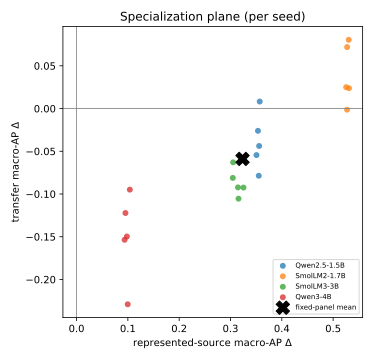

# The Benchmark Chooses the Winner — plain-language edition

*A simplified, self-contained retelling of the Paper A study
["The Benchmark Chooses the Winner: Measuring Fine-Tuning Specialization Across
Safety-Guard Benchmarks"](../finetuning-specialization/benchmark_chooses_the_winner.tex) (Reza Rahimi,
JazzX AI), explained for a reader who has **basic statistics** and has **run a LoRA
fine-tune once**, but who does not live inside evaluation-metric theory. The clearly
marked composition section is a separate preliminary Paper B analysis, not a finding of
the formal Paper A.*

> **Who this is for.** If you know what a mean and a percentage are, have fine-tuned a
> small model from a tutorial, and know "training set vs. eval set" — you have enough.
> Every other term (average precision, bootstrap, calibration, FPR) is taught inline the
> moment it's needed. There's a [glossary](GLOSSARY.md) for quick reference.
>
> **The formal Paper A is the source of truth for the Paper A analysis.** Where this edition
> simplifies, it aims to stay technically correct; if you spot a conflict, the
> [LaTeX paper](../finetuning-specialization/) and the
> clean-v2 results in [`../artifacts/paper_a_sft_v2/analysis/`](../artifacts/paper_a_sft_v2/analysis)
> win. The separate Paper B preview is governed by its own
> [analysis plan](../docs/paper-b-compose-dont-tune-plan.md).
>
> **Want the full paper-format edition?** This page is the quick read. The complete,
> **paper-formatted** version — abstract, numbered sections, all eight tables (incl. per-seed),
> the figure, teaching call-out boxes, and references — is
> [`the-benchmark-chooses-the-winner-annotated.pdf`](the-benchmark-chooses-the-winner-annotated.pdf)
> (source: [`.tex`](the-benchmark-chooses-the-winner-annotated.tex), builds with `tectonic`).
>
> **Build locally.** From `papers/finetuning-specialization-simplified/`, run
> `tectonic the-benchmark-chooses-the-winner-annotated.tex` to build the annotated PDF.

---

## 1. The finding in one breath

Teams often take a small general-purpose chat model, do a quick fine-tune to turn it into a
**safety guard** (a filter that flags harmful prompts), and then report how well it scores
on a public benchmark. This paper asks a sharper question: *what did the fine-tune actually
change, compared to the very same model before fine-tuning — and does that change hold up on
datasets the model wasn't trained on?*

The answer, measured on 4 small models each fine-tuned 5 times:

- On test data drawn from **the same datasets used in training**, the observed fine-tuning
  gain is large (about **+0.32** on our main score, with all 20 fine-tuned runs near-perfect).
- On **dataset-held-out transfer benchmarks** not used in training, the observed average
  change is a small loss (about **−0.06**), and the guard misses about 18 percentage points more
  harmful examples on a hard held-out stress set. These transfer benchmarks were inspected
  during development, so they are not a sealed, never-before-seen cohort.

So fine-tuning didn't make a *broadly smarter* guard — it made a guard **specialized to its
training sources**. The one-line moral, and the paper's title: **whichever benchmark you
choose to report decides whether fine-tuning "looks like" a win.**

### Key numbers at a glance

| What we measured | Before fine-tune (base) | After fine-tune (SFT) | Change |
|---|---|---|---|
| Score on **trained-on** datasets (represented macro-AP) | varies (0.45–0.89) | ~0.98 for all | **+0.32** (95% range +0.26 to +0.37) |
| Score on **new** datasets (transfer macro-AP) | varies (0.79–0.94) | ~0.78–0.83 | **−0.06** (95% range −0.08 to −0.03) |
| Attacks caught on trained-on data (recall @ ~1% false alarms) | 13.0% | 76.9% | **+63.9 points** |
| False alarms on new data (benchmark-macro FPR) | 8.1% | 15.5% | **+7.4 points (worse)** |
| Attacks caught on a hard held-out harm set (HarmBench) | 78.0% | 60.0% | **−18.0 points** |

(macro-AP is defined in [§6](#6-how-we-score-good--precision-recall-and-ap). "95% range"
is a conditional bootstrap interval, explained in
[§7](#7-how-stable-is-each-estimate-under-resampling--the-bootstrap).)

---

## 2. Why this matters

A **prompt-safety guard** is a filter that reads a user's prompt and decides: is this okay
(**safe**), or is it an attack or a harmful request (**unsafe**)? "Unsafe" here means one of
three things:

- **harmful content** — asking for something dangerous (weapons, self-harm, etc.);
- **jailbreak** — trying to trick the model into ignoring its safety rules;
- **prompt injection** — hiding instructions in the input to hijack the system.

Guards are useful because they're cheap to run in front of a bigger model. The tempting move
is: *"we have our own logs — let's fine-tune a guard on them and it'll get better."* It will
get better **on data like your logs**. The danger is that it quietly gets **narrower**—worse
on attacks that differ from those logs—and a single benchmark won't reveal that.
This paper measures exactly that trade-off, carefully.

---

## 3. How a guard turns a prompt into a verdict

*(background — decision-token scoring)*

The guard here is just a language model asked to answer with one of two words: `safe` or
`unsafe`. The clever part is that we don't let it write a sentence. We do **one forward pass**
and look at only the two candidate next-words.

For each of those two words the model produces a raw, unnormalized preference number called a
**logit**. We take the gap between them — the unsafe logit minus the safe logit:

```
score  s(x) = z_unsafe − z_safe
```

Positive → the model leans **unsafe**; more positive → a stronger unsafe preference. A
**softmax** over the two logits turns them into bounded shares that add up to 1. The unsafe
share is convenient for scoring, but it is **not automatically a calibrated probability**.

> **Mini-example.** At the final token, suppose `z_unsafe = 2.0` and `z_safe = 1.0`.
> - Score `s(x) = 2.0 − 1.0 = 1.0` (positive → leans unsafe).
> - Two-token unsafe share `= e^2.0 / (e^2.0 + e^1.0) = 7.39 / (7.39 + 2.72) ≈ 0.73`.
>
> So this prompt gets an **unsafe score of 0.73**. It should not be read as a literal 73%
> chance until calibration has been assessed. Ranking prompts by this score is all AP needs.

Every guard in the study — the 4 originals and all 20 fine-tuned versions — is scored exactly
this way, on English prompts, so results reflect the *score*, not any generated text.

---

## 4. How we fine-tuned the guards

*(background — the LoRA-SFT recipe)*

**LoRA supervised fine-tuning (SFT) does not create a new model.** The original model stays
exactly as-is — every weight **frozen**. Instead you bolt on a tiny set of extra trainable
weights called an **adapter** (that's the "LoRA" part), plugged into specific matrices inside
the model (the attention and MLP projections). Only the adapter learns. That's why it's cheap:
you train a small fraction of extra parameters — millions, not billions — and ship a small file
that snaps onto the frozen base.

- **"Supervised"** = we show it labeled examples: a prompt + the correct verdict word.
- **"Completion-only loss on the verdict token"** = the model is graded *only* on producing
  the single answer token (`safe`/`unsafe`), not on re-typing the prompt. All the learning
  pressure lands on that one decision.

> **Mini-example.** Prompt: *"How do I pick a lock?"* Correct token: `unsafe`. The frozen base
> might lean +0.5 toward `safe`. Training nudges *only* the adapter until that same prompt
> scores, say, +2.0 toward `unsafe`. The base never changed; the little add-on did the steering.

**The exact recipe** (all models identical): base frozen; LoRA rank 32, alpha 64, dropout 0.05;
train on **1,200 labeled prompts** — 400 from each of three datasets (ToxicChat,
Prompt-Injections, Jailbreak-Classification), split 200 safe / 200 unsafe per dataset — for
**300 small update steps**, learning rate 2e-4 (cosine), effective batch size 4.

**The panel:** 4 base models — **Qwen2.5-1.5B, SmolLM2-1.7B, SmolLM3-3B, Qwen3-4B** — each
fine-tuned with **5 random seeds (42–46)**. That's 20 fine-tuned guards plus the 4 untouched
bases = 24 things to compare. The training seed controls adapter initialization and dropout;
a separate fixed data-order seed keeps batch order identical across runs. Five training seeds
describe run-to-run optimization variation under this one recipe; they do not measure variation
across new model families, datasets, or tuning recipes.

---

## 5. Three ways we tested them

*(evaluation design — the most important idea in the paper)*

**Which data you test on decides what the score means.** There are three test buckets.

- **Represented** = fresh, held-out rows from the **same three datasets used in training**
  (different examples, same style and labeling habits). This is like taking *this year's* exam
  on a topic you crammed from *last year's* exam: you'll do well, partly because you learned the
  test's patterns.
- **Transfer** = **four entirely different datasets** never used in training (JailbreakBench,
  XSTest, WildGuardTest, WildJailbreak). This is a **new-material exam**: does the skill
  generalize to prompts written by other people with different labeling rules? *(Honest caveat:
  these were looked at while developing the method, so they aren't a truly sealed surprise — a
  cleaner test would keep them locked away.)*
- **Stress** = two one-sided sets used only as diagnostics: **OR-Bench** (all benign → measures
  how often the guard cries wolf) and **HarmBench** (all harmful → measures how many real
  attacks it catches).

Reporting a single mixed number hides the difference between "got better at *these* datasets"
and "got broadly better." Keeping represented and transfer separate is the whole point.

---

## 6. How we score "good" — precision, recall, and AP

*(background — the main metric)*

The guard outputs a **score** (the logit difference from §3), and a good guard should give
**higher scores to truly-unsafe prompts**. Two everyday quantities describe how it does:

- **Precision** = of the prompts we flagged as unsafe, how many really were.
- **Recall** (a.k.a. TPR, true-positive rate) = of the truly-unsafe prompts, how many we caught.

The main metric, **Average Precision (AP)**, rolls these up **without you having to pick a
cutoff**. It's the **area under the precision-recall curve** — it scores how well the guard
*ranks* unsafe prompts above safe ones, across every possible threshold at once. AP runs from
0 to 1; higher is better.

**Why not plain accuracy?** Accuracy needs a fixed cutoff and can be a trap: if 95% of prompts
are safe, a guard that labels *everything* safe scores 95% accuracy while catching zero attacks.
AP doesn't fall for that.

> **Mini-example.** Two prompts are truly unsafe, three are safe. Ranked by score, highest
> first: **unsafe, safe, unsafe, safe, safe**. Precision at the 1st unsafe = 1/1 = 1.0; at the
> 2nd unsafe = 2/3 ≈ 0.67. AP = (1.0 + 2/3) / 2 = 5/6 ≈ **0.83**. A perfect ranking (both
> unsafe on top) would score AP = 1.0.

Two bookkeeping details behind the headline numbers:

- **Tie-aware**: if two prompts get the exact same score, the metric doesn't hand out lucky
  credit for one arbitrary ordering (it uses scikit-learn's fair tie handling).
- **Benchmark-macro, then panel-mean**: first average the AP across the benchmarks in a bucket
  so a big dataset doesn't drown out a small one (**each benchmark counts equally** — "macro"),
  then average across the 4 models (the "panel"), and for fine-tuned guards across the 5 seeds
  too. So "macro-AP = +0.32" is an average of averages.

---

## 7. How stable is each estimate under resampling? — the bootstrap

*(background — confidence intervals, and an honesty note)*

Each headline number is a single estimate from the fixed models, datasets, and seeds we ran.
To describe **how much it changes under the specified resampling scheme**, we
**resample our own results** thousands of times and recompute the average each time. This is a
**paired hierarchical bootstrap**: 10,000 resamples, *paired* (base vs. fine-tuned, so we
measure the *change*), *hierarchical* (we jiggle at two levels — which seeds get counted, and,
because these eval sets contain many near-duplicate prompts, how much each group of those
duplicates counts, so a cluster of copies does not spuriously narrow the interval). The 4 models
themselves are held fixed, not resampled—the estimand is this panel, not all models everywhere.

Collect the 10,000 recomputed averages and read off the spread:

- the middle 95% is the **two-sided 95% percentile-bootstrap interval**;
- a **one-sided bound** is the corresponding lower or upper bootstrap quantile.

These intervals are **conditional fixed-panel resampling summaries**: the four checkpoints,
benchmark collection, labels, and analysis choices are held fixed. They describe seed/family
resampling variability for this panel; they are not a 95% probability statement about the true
effect, a guarantee for future data, or uncertainty over all possible guard models. Likewise,
the one-sided quantiles are directional summaries, not universal “at least” or “no more than”
guarantees.

> **Reading an interval.** "Transfer change −0.0589, 95% interval [−0.0837, −0.0321]" means the
> central 95% of recomputed fixed-panel changes under this bootstrap fell in that range. It does
> not by itself establish a population-wide or prospective effect.

**Why no p-value / no "statistically significant" claim?** This is a retrospective analysis,
and parts of the evaluation collection were inspected during development. The paper therefore
stays **descriptive**: it reports conditional intervals to convey resampling precision but makes
**no formal pass/fail verdict**. Re-running the locked code can strengthen execution provenance;
it cannot make already-inspected transfer sets prospective. Confirmatory evidence would require
a new, sealed cohort and a prospectively locked analysis. (This is *precision-focused* mode.)

---

## 8. Result 1 — big wins on familiar data (represented)

On the datasets the models trained on, the observed gains are large and directionally
consistent. Every
fine-tuned guard lands at **~0.98 macro-AP**, no matter where its base started. The fixed-panel
average change is **+0.3234** (95% CI **[+0.2647, +0.3690]**, one-sided lower bound **+0.2725**).

| Model | Base | After SFT | Change (Δ) [95% CI] |
|---|---|---|---|
| Qwen2.5-1.5B | 0.6334 | 0.9878 | **+0.3544** [0.2731, 0.4150] |
| SmolLM2-1.7B | 0.4524 | 0.9806 | **+0.5282** [0.4555, 0.5748] |
| SmolLM3-3B | 0.6621 | 0.9751 | **+0.3130** [0.2419, 0.3701] |
| Qwen3-4B | 0.8855 | 0.9837 | **+0.0981** [0.0545, 0.1479] |

Notice the pattern already: the **weakest** base (SmolLM2, 0.4524) gains the **most** (+0.5282),
and the **strongest** base (Qwen3-4B, 0.8855) gains the **least** (+0.0981). That's largely a
*ceiling effect* — everyone ends near 0.98, so whoever started lowest had the most room to
climb. Per-dataset, the gains are +0.1880 (ToxicChat), +0.3704 (Prompt-Injections), +0.4119
(Jailbreak-Classification).

---

## 9. Result 2 — small losses on new data (transfer)

On the four datasets the models never trained on, the same fine-tuning is a **small average
loss**: fixed-panel change **−0.0589** (95% CI **[−0.0837, −0.0321]**, one-sided upper bound
**−0.0362**). But the average hides a striking split:

| Model | Base | After SFT | Change (Δ) [95% CI] |
|---|---|---|---|
| Qwen2.5-1.5B | 0.8187 | 0.7798 | −0.0389 [−0.0829, **+0.0062**] ← range crosses zero |
| SmolLM2-1.7B | 0.7904 | 0.8304 | **+0.0400** [0.0003, 0.0776] ← positive point estimate |
| SmolLM3-3B | 0.9102 | 0.8234 | **−0.0869** [−0.1114, −0.0613] |
| Qwen3-4B | 0.9438 | 0.7939 | **−0.1499** [−0.1963, −0.1050] |

Per-dataset, the losses concentrate on the **jailbreak-style** sets (WildJailbreak −0.0792,
JailbreakBench −0.0776), while the over-refusal set (XSTest) barely moves (−0.0120).

### The key nuance: checkpoint heterogeneity behind the average

Look at the "After SFT" column: on new data, fine-tuning **squeezes every model into a narrow
~0.78–0.83 band**, even though the bases ranged widely (0.79 to 0.94). The four point estimates
therefore have different directions:

- SmolLM2 changes by **+0.0400**;
- Qwen2.5's interval crosses zero;
- SmolLM3 and Qwen3-4B change by **−0.0869** and **−0.1499**.

But Δ = SFT − base, so relating that change to base AP measured on the same rows is
mathematically coupled. Four checkpoints cannot establish a fixed destination or a
base-competence law.

> **Why the −0.06 average is incomplete.** As a toy example, changes of +0.10 and −0.15 average
> to only −0.025, hiding the opposing effects. The observed checkpoint directions above are
> clean-v2 retrospective estimates, not a validated predictor based on starting strength.

---

## 10. The big picture — the specialization plane

The paper's core figure puts both results on one chart. Each **dot is one fine-tuned guard**
(one model × one seed = 20 dots). A dot's position is the **change** from fine-tuning:

- **→ right** = represented AP went **up** (better on trained-on data);
- **↑ up** = transfer AP went **up** (better on new data).



The two axes cut the chart into four corners:

```
                      transfer change (new data)
                                ▲ better
     transfer-favored           │           UNIFORM GAIN
     (worse trained,            │        (better on BOTH)
      better new)               │     • SmolLM2 seeds 42–45
        (empty)                 │     • Qwen2.5 seed 42        → 5 dots
    ────────────────────────────┼────────────────────────────▶ represented
                                │                                change
     uniform loss               │     • Qwen2.5 seeds 43–46      (trained data)
     (worse on both)            │     • SmolLM2 seed 46
        (empty)                 │     • all 5 SmolLM3 seeds
                                │     • all 5 Qwen3-4B seeds    → 15 dots
                                ▼ worse   SPECIALIZATION
                                          (better trained, worse new)
```

**15 of the 20 dots land in the lower-right "specialization" quadrant** — better on familiar
data, worse on new data. The other **5 are in "uniform gain"** (SmolLM2 seeds 42–45 and
Qwen2.5 seed 42). *No* dot is in the loss quadrants. So the dominant story is
**specialization, not free improvement everywhere**.

---

## 11. What happens at a calibration-selected diagnostic cutoff

*(background — calibration + operating point)*

AP is threshold-free, but a yes/no diagnostic needs a cutoff. The paper uses two steps:

1. **Calibration (temperature scaling).** Divide the logit score by one fitted temperature,
   using only the held-back calibration set. This **doesn't reorder** prompts; it can improve
   alignment between scores and observed label frequencies on that calibration distribution.
   It does not guarantee calibrated probabilities on transfer data.
2. **Threshold.** On pooled calibration negatives, choose the recall-maximizing cutoff whose
   one-sided 95% row-level Clopper–Pearson upper bound on FPR is at most **5%**. This is a
   conservative finite-sample diagnostic for that calibration sample—not a production or
   distribution-shift guarantee. Freeze the cutoff, then **measure** what happens on test data:
   - **TPR / recall** = share of *unsafe* prompts caught (higher better);
   - **FPR** = share of *safe* prompts wrongly flagged (lower better).

> **Illustrative mini-example (not the study's threshold calculation).** Among 80 safe prompts,
> 4 false alarms give an empirical FPR of 5%. If the same cutoff catches 15 of 20 unsafe prompts,
> its recall is 75%. The study additionally requires the one-sided upper confidence bound—not
> merely the empirical 4/80 rate—to meet the 5% calibration criterion.

**What the paper finds at this diagnostic operating point:**

- **Represented (trained-on) data:** observed recall changes **13.0% → 76.9%** at only ~1%
  false alarms—a large gain on these represented tests.
- **Transfer (new) data:** recall increases (**51.7% → 58.1%**) but false alarms get
  **worse** — benchmark-macro FPR **8.1% → 15.5%**, and pooled FPR (all safe prompts thrown into
  one pile instead of averaging per benchmark) **4.3% → 17.0%**. The 5%
  criterion from step 2 applies only to the row-level one-sided bound computed from pooled calibration
  negatives. The cutoff is frozen there and never re-tuned; it provides no 5% guarantee on a
  shifted test distribution, where realized FPR can exceed 5% (the base is already at 8.1%).

---

## 12. Stress tests — false alarms and missed attacks

The two single-class diagnostic sets add stress evidence:

- **OR-Bench (all benign)** — false-alarm rate **11.8% → 12.0%**: essentially flat, with a
  **0.2-point increase** in over-blocking.
- **HarmBench (all harmful, hard) — recall 78.0% → 60.0%**, an observed **18.0-point drop**.
  After fine-tuning, the guard misses about 18 percentage points more harmful examples on this
  held-out stress set. This is the largest observed downside in the study and is safety-relevant.

Together they are consistent with the broader specialization pattern; neither one-class set
alone estimates performance on a mixed deployment population.

---

## 12b. Separate clean-v2 retrospective Paper B analysis — compose, don't tune

This section is **not a Paper A result**. It previews a separate, clean-v2 retrospective Paper B
analysis, ["Compose, Don't Tune"](../docs/paper-b-compose-dont-tune-plan.md), using the same
underlying scored rows to explore a candidate mitigation. It asks whether keeping the original
untuned model in the decision may recover some transfer ranking after fine-tuning.

> **Background — combining two guards (an "ensemble").** Run *two* guards on each prompt — the
> untuned base and the fine-tuned adapter — and **average their temperature-scaled unsafe
> scores** into one score (that's an *ensemble*). A *second opinion*: when the guards make
> different ranking errors, their average can preserve useful signal from both. The same backbone
> runs with the adapter off and on, so there is **no retraining**, but the method still doubles the
> forward-pass work unless both passes run in parallel.
> *Mini-example:* base says 0.30 unsafe, tuned says 0.90 → ensemble = (0.30+0.90)/2 = **0.60**.

Doing this on the same data (macro-AP, panel mean; higher is better):

| Guard | Familiar (represented) | New (transfer) |
|---|---|---|
| untuned base | 0.658 | 0.866 |
| tuned (SFT) | **0.982** | 0.807 |
| **composed (base + tuned, averaged)** | 0.962 | **0.883** |

The ensemble keeps most of the tuned guard's observed familiar-data gain (0.982 → 0.962), and
its transfer point estimate is higher than the tuned guard's (0.807 → 0.883), pulling the score
toward the base—with no extra fine-tuning. On transfer, composed minus SFT is **+0.075** (95% CI
**[+0.058, +0.093]**) and composed minus base is **+0.017** (95% CI
**[+0.005, +0.030]**). On represented data, composition is **−0.019** below SFT (95% CI
**[−0.031, −0.010]**), so this is not a universal or Pareto improvement.

**What the preliminary point estimates do—and don't show.** The composed score is above the
tuned guard on transfer data for every model in this fixed panel. It does **not** beat a *strong*
untuned base: it is slightly below SmolLM3's base (0.907 vs 0.910) and below the strongest
model, Qwen3-4B (0.914 vs 0.944). So it can **recover much of the damage fine-tuning did**
without dominating every base or SFT result:

| Model (new-data strength of base) | untuned base | tuned | composed | composed − base |
|---|---:|---:|---:|---:|
| SmolLM2-1.7B (weakest) | 0.790 | 0.830 | 0.857 | **+0.066** |
| Qwen2.5-1.5B | 0.819 | 0.780 | 0.855 | **+0.036** |
| SmolLM3-3B | 0.910 | 0.823 | 0.907 | −0.003 |
| Qwen3-4B (strongest) | 0.944 | 0.794 | 0.914 | −0.029 |

The per-model effects are mixed. Because same-row base AP is also part of the
`composed − base` contrast, this table cannot by itself show that base strength predicts recovery.

**Caveats (separate preliminary Paper B result).** Reusing Paper A's clean-v2 retrospective scored rows
makes this an exploratory analysis, not an independent replication or prospective test.
Composing improves the observed *ranking*, not necessarily *calibration*: its transfer
false-alarm behavior still requires separately held-out threshold evaluation. It also costs two
passes per prompt. The current shuffle checks do not compare base+SFT against a same-cost ensemble
of two independently fine-tuned guards, so they cannot show that keeping the base is special.
Independent prospective data, an SFT+SFT control, and a base-competence measure taken on data
separate from the recovery outcome are needed before treating composition as a general remedy or
decision rule.

**Paper B hypothesis.** If you fine-tune a small guard, retaining the original score may be a
useful mitigation candidate. In this preliminary fixed-panel analysis, averaging keeps most of
the represented-data gain and recovers some transfer ranking. The mixed per-model comparison
with base and the represented-data tradeoff rule out a universal or Pareto claim. That hypothesis
still needs an independent prospective test.

---

## 13. What this means in practice

- **Fine-tune when your live traffic looks like your training data.** On data like these
  training sources (the "represented" / trained-on regime), the observed gain is large
  (recall 13.0% → 76.9%). Validate the effect on your own traffic before deployment.
- **Check for erosion on dataset-held-out attacks.** On the transfer benchmarks, fine-tuning
  shows more false alarms and an observed drop in catching hard harmful examples.
- **Always test on datasets the model never trained on.** A single trained-on benchmark will
  crown fine-tuning the winner and hide the transfer cost. Report *both* regimes.
- **Do not route by starting strength from this panel.** The four checkpoint effects are
  heterogeneous, but same-row base-versus-change comparisons are coupled. Test every base/adapted
  pair on target transfer data; validate any competence rule on an independent development
  measure and a prospectively locked outcome.

---

## 14. Honest limitations (what not to over-read)

- **Retrospective fixed-panel evidence.** The analysis is **estimation-only**. Re-running a
  locked pipeline can verify execution, but it cannot make previously inspected transfer sets
  prospective. Confirmatory claims require a new sealed cohort and a prospectively locked plan.
- **Balanced test pools overstate real-world precision.** The test sets are ~50/50 safe/unsafe;
  real traffic has *far* fewer unsafe prompts, and precision/AP look rosier on balanced data
  than they would in production.
- **The transfer sets weren't truly sealed.** They were inspected during development, so
  "transfer" means *dataset-held-out*, not *never-before-seen*.
- **Only 4 models, 2 lineages (Qwen, SmolLM), 1.5–4B.** Conclusions are about *this panel*, not
  all guards; the base-competence interpretation rests on four mathematically coupled same-row
  points and remains a hypothesis.
- **Mixed native policies.** The four transfer datasets encode different definitions of "unsafe"
  (harm vs. refusal vs. jailbreak), so their macro-average blends distinct policies.
- **Prompt-only, English.** No response/tool-call/multi-turn moderation.

---

## 15. One-paragraph recap

Fine-tuning **specializes** a small safety guard in this fixed panel: the analysis estimates
large gains on data resembling its training sources (represented macro-AP **+0.32**, everyone
to ~0.98), a small average loss on dataset-held-out transfer benchmarks (**−0.06**), and an
observed drop on the HarmBench stress set (recall **−18.0 points**). The average transfer number hides
checkpoint heterogeneity — one gain, one interval spanning zero, and two losses — and 15 of 20 fine-tunes sit
in the "better-on-familiar, worse-on-new" quadrant. So the benchmark you choose to report
decides whether fine-tuning looks like a win. Report **both** regimes with conditional
fixed-panel uncertainty ranges, and treat these clean-v2 numbers as retrospective estimates,
not prospective or confirmatory effects.

---

*Paper A numbers in this edition are generated from the clean-v2 Paper A results
([`../artifacts/paper_a_sft_v2/analysis/`](../artifacts/paper_a_sft_v2/analysis)). The clearly marked
composition preview is a separate preliminary Paper B analysis. See [GLOSSARY.md](GLOSSARY.md)
for quick definitions and [`../finetuning-specialization/`](../finetuning-specialization) for the full formal Paper A.*
