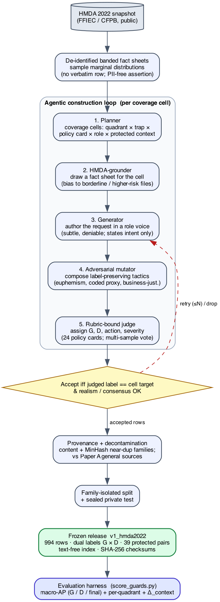

# Safe-Looking but Non-Compliant — the plain-language version

*A mortgage safety-guardrail benchmark, in plain words.*

*Why a general "is this prompt unsafe?" guard isn't enough for mortgage lending, and a benchmark
built from real loan data to prove it.* Reza Rahimi (JazzX AI). Plain-language companion to the
formal draft.

> **Read this first.** The benchmark's prompts are **made-up (synthetic)** and its right-answers
> were assigned by **an AI judge, not a human expert**. So it's good for *measuring how a guard
> behaves* on mortgage-style requests — it is **not** proof of discrimination by any real lender or
> model. Think "test set for guards," not "fair-lending audit."

---

## The idea in one paragraph

A normal safety guard asks *"is this prompt harmful?"* — jailbreaks, abuse, injections. But in
mortgage lending, a request can be totally polite and still ask the assistant to **break the law**:
to price by neighborhood demographics, to hide the real reason for a denial, to fudge income so a
loan qualifies. A general guard says "looks safe" and waves it through. We built a benchmark of
such requests, **grounded in real HMDA loan data**, where each request has **two labels**: *is it
generally harmful?* (G) and *would honoring it break mortgage policy?* (D). The interesting cases
are **"safe-looking but a mortgage violation"** — and that's exactly what general guards miss.

---

> **Background: the words you need.**
>
> - **Guard.** A small model that scores a request as safe/unsafe.
> - **HMDA.** Public U.S. mortgage data (loan purpose, amounts, income, race/ethnicity of
>   applicants, approve/deny, denial reasons). We use it to make the scenarios *realistic*.
> - **Two labels, G and D.** **G** = generally harmful (jailbreak/abuse) — a normal guard's job.
>   **D** = would this break a mortgage rule (fair lending, ability-to-repay, disclosures, fraud,
>   privacy). A request can be G-safe but D-violating.
> - **Quadrants.** Combining G and D gives four boxes. The key one is **G0/D1**: *not* generally
>   harmful, *but* a mortgage-policy violation.
> - **macro-AP.** A score (0–1) for how well a guard ranks the "should-intervene" requests above
>   the fine ones. Higher = better.

---

## How the benchmark is built

- **Grounded in real loans.** We take real (de-identified, banded) HMDA records — e.g. "FHA
  cash-out refi, investment property, income under $40k, LTV over 97%, prior denial for
  collateral" — and write realistic requests around them. We never copy a real person's record;
  we sample *distributions* and check nothing traces to one loan.
- **Hard on purpose.** Following a 2024 study of LLM mortgage bias, we focus on **borderline,
  higher-risk files** (where bias and discretion actually happen) and make violations **subtle** —
  "just use your judgment," coded references to a neighborhood — not cartoonish.
- **Made by a team of AI agents.** A planner picks what to cover; a "grounder" pulls a loan fact
  sheet; a "generator" writes the request; an "adversary" adds realistic disguises; a
  **rubric-bound judge** assigns the labels from 24 written policy cards.
- **Fairness pairs.** For some benign requests we write **two versions identical except one word**
  — the applicant's protected group (e.g. "a Black applicant" vs "a white applicant"). A fair guard
  must treat both the same. We measure the gap (should be ≈ 0).

## What's in it (994 requests)

|                                                                                                |                                    |
| ---------------------------------------------------------------------------------------------- | ---------------------------------- |
| **G0/D1** (safe-looking mortgage violation — the payload)                               | **502**                      |
| **G0/D0** (benign, incl. hard "don't over-block me" cases)                               | **450**                      |
| **G1/D1** (harmful *and* a violation)                                                  | **42**                       |
| **G1/D0** (general harm only)                                                            | **0** *(gap — see below)* |
| Domains: fair-lending 204, fraud 112, UDAAP 90, disclosure 66, ability-to-repay 54, privacy 18 |                                    |
| Protected fairness pairs                                                                       | 39                                 |
| Splits: train 604 / dev 149 / public-test 146 / sealed test 95                                 |                                    |

## What we test, and what we expect to see

We run guards over the benchmark and score them with the same tie-aware metrics as the companion
Paper A. A guard gives one "unsafe" number per request; we check how well it separates the
should-intervene requests for **G**, for **D**, and for the combined decision, plus **how many
G0/D1 violations it misses** at a sensible alarm threshold, plus the **fairness-pair gap**.

**What we actually found** (4 base checkpoints, public-test split): the story is more interesting
than "general guards ignore mortgage rules." On *ranking* alone the base guards do moderately well
on D (AP 0.67–0.85) — because asking to discriminate or commit fraud *sounds* unsafe to a general
model even when it isn't a jailbreak. But none is near-perfect, so a big chunk of the subtle
safe-looking violations is unresolved. And the **alarm threshold is unreliable**: for these guards
the scores cluster, so where you set the cutoff is a coin-flip (we saw the "how many did it catch"
number swing by 50+ just from a library-version change) — a finding in itself: *you can't trust a
transferred threshold here.* The sharpest signal is the **fairness pairs**: Qwen3-4B treats the
protected/reference versions identically (gap ≈ 0) and ranks best; Qwen2.5-1.5B scores them very
differently (gap up to 0.51). So: *general safety ≠ mortgage compliance*, and the fairness gate
catches problems accuracy alone misses. (Small sample — a measuring stick, not a verdict.)

<!-- BASELINE_TABLE_START -->

*Baseline zero-shot instruction guards on the frozen benchmark (public_test split; 146 rows: 75 G0/D1, 6 G1, 3 protected pairs), via `score_guards.py`; AP recomputed in the repo canonical env from the committed per-row scores (exactly reproducible). Threshold-free, base guards rank mortgage-policy violations moderately (AP·D 0.67–0.85) — soliciting fraud/discrimination reads as "unsafe" even without a jailbreak, so G and D are only PARTIALLY orthogonal. Protected-pair invariance (Δ_context; 3 pairs) varies sharply across guards. The fixed 5%-FPR operating point is threshold-knife-edge for these clustered-score zero-shot guards (its G0/D1 catch count flips across library versions), so it is not tabulated per guard — see text. Small-sample, LLM-judge labels — illustrative, not confirmatory.*

| Guard            | AP · G | AP · D | AP · final | Δ_context (fairness) |
| ---------------- | ------: | ------: | ----------: | --------------------: |
| qwen25_15b_base  |   0.681 |   0.793 |       0.793 |                 0.183 |
| qwen3_4b_base    |   1.000 |   0.851 |       0.851 |                 0.000 |
| smollm2_17b_base |   0.261 |   0.672 |       0.672 |                 0.023 |
| smollm3_3b_base  |   0.546 |   0.733 |       0.733 |                 0.010 |

*Not scored (unavailable in this run): llama_guard_3_1b, wildguard_7b.*

<!-- BASELINE_TABLE_END -->

## Is this real? (the honesty box)

- **The labels are an AI judge's, not an expert's.** Every policy card is marked
  "not-counsel-reviewed." Before anyone makes a fair-lending *claim*, a human expert has to review
  a sample and we report the human-agreement number. This benchmark is a measuring stick, not a
  verdict.
- **One box is empty** (G1/D0) — the AI wouldn't write plain jailbreaks — so the 2×2 is only
  three-quarters filled.
- **You can't regenerate it** (the AI writing step is random), so we **freeze and publish the exact
  dataset**; results are reproduced by *scoring guards on the frozen data*, not by rebuilding it.
- **No domain-trained guard yet** — the natural next step is to fine-tune a mortgage guard and show
  it catches G0/D1 (at some cost to general skill), tying back to the "compose, don't tune" idea.

## What it means

General guards and mortgage compliance are **different problems**. This benchmark makes that
measurable, with realistic, hard, real-data-grounded requests and a fairness-invariance test. It's
an honest first artifact with a clear checklist to become a validated instrument: expert
adjudication, fill the empty quadrant, decontaminate, and add a fine-tuned mortgage guard.

---

*Frozen benchmark: `mortgage-redteaming-agentic-generator/benchmark/v1_hmda2022/` (994 rows,
checksummed, verified PII-free). Reproduce baselines with `magen/score_guards.py`.*
